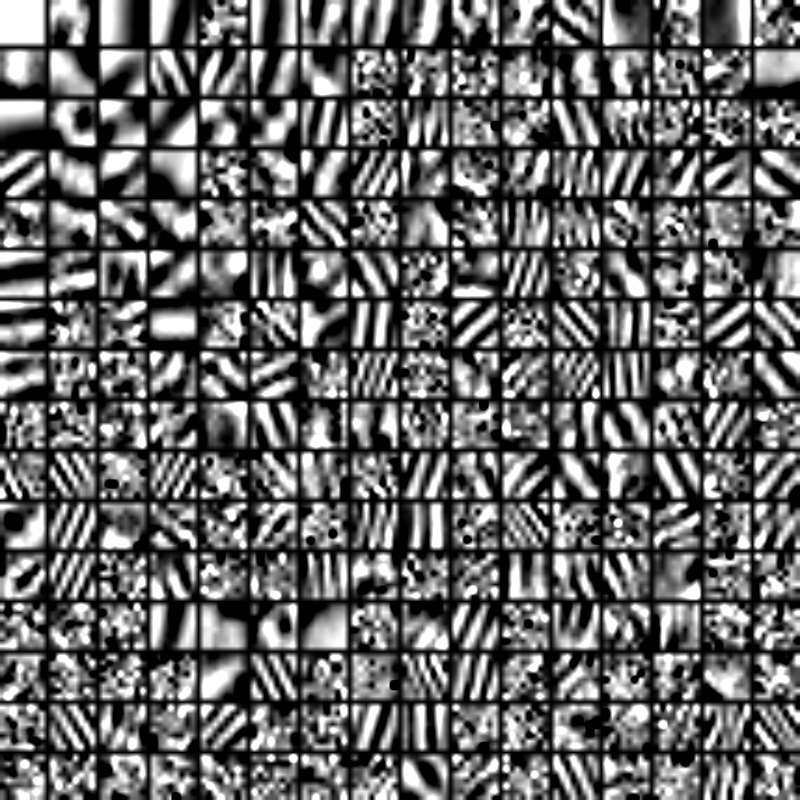
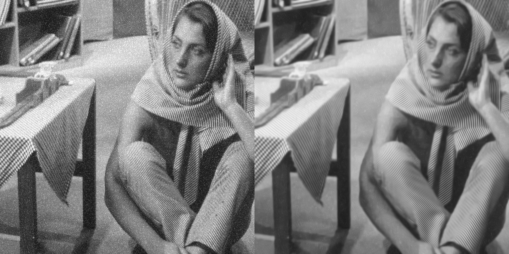

Sparsec Coding
============

Sparse dictionary learning for image denoising and superresolution.

Tobias Gurdan 
tobias@gurdan.de 

Description 
===
Small summer break project after getting in contact and being fascinated by sparse coding (see 3d shape analysis slides in https://github.com/gurki/paper).
